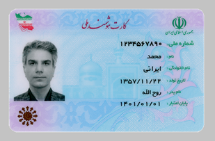
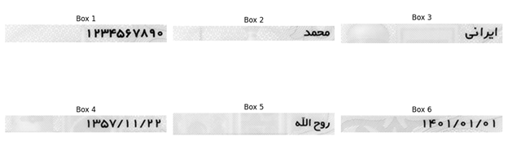

# National Card OCR Desktop App

A Python desktop application for detecting and cropping Iranian national ID cards, extracting key identity fields using OCR, cropping the personal photo, and saving the extracted data to an Excel file.

This project was developed in December 2025, as a university Computer Vision course project, using Python, OpenCV, EasyOCR, and Tkinter.

## Features

- Upload national card images through a desktop GUI
- Detect and crop the national card from the uploaded image
- Crop the data area of the card
- Detect separate text boxes for identity fields
- Extract Persian and English text using EasyOCR
- Normalize Persian digits
- Crop the personal photo from the card
- Save extracted fields to an Excel file
- Store cropped personal images in a local folder

## Processing Steps

### 1. Input Card

  

### 2. Detected Text Areas

  

### 3. Detected Personal Photo

  

> Note: The sample card image is a fictional, non-real card sourced from the internet and is used only for demonstration.

## Tech Stack

- Python
- Tkinter
- OpenCV
- EasyOCR
- Pillow
- NumPy
- OpenPyXL
- Matplotlib

## Extracted Fields

- Personal photo
- National ID
- First name
- Last name
- Birth date
- Father's name
- Expiration date

## Notes

- The OCR quality depends on image resolution, lighting, card angle, and text clarity.
- OCR processing may take a few seconds to start because the EasyOCR model needs to be initialized and loaded into memory.
- This project is intended for educational use and is not production-ready for handling sensitive identity documents.
